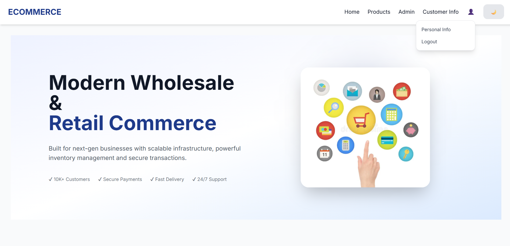
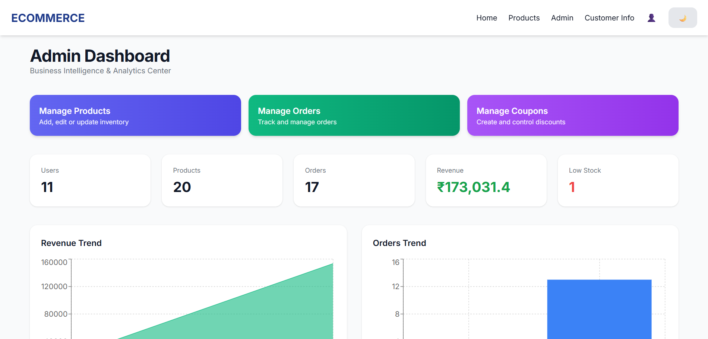
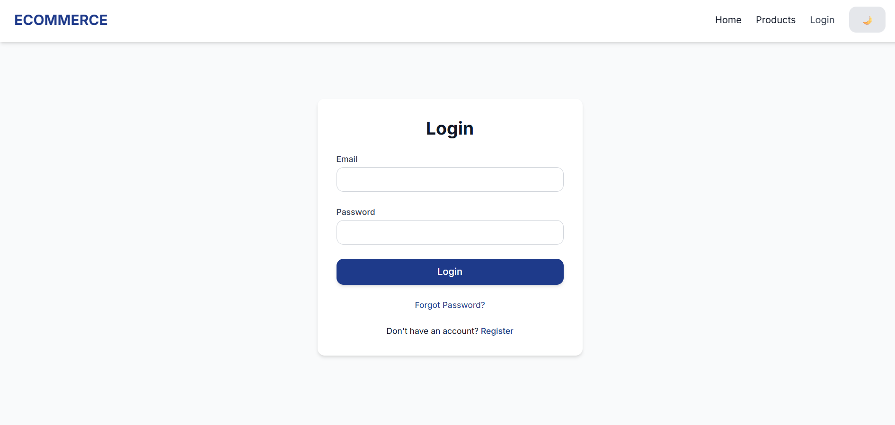
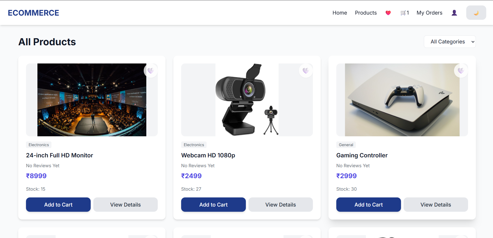

# 🛒 E-Commerce Management System

### Full Stack MERN E-Commerce Platform

A modern full-stack e-commerce platform built using the MERN stack with secure authentication, admin dashboard, inventory management, customer management, order tracking, and coupon management.

🌐 **Live Demo**

https://e-commerce-shop-proj.vercel.app

---

# ✨ Features

- User Authentication
- JWT Authorization
- Admin Dashboard
- Customer Management
- Product Management
- Order Management
- Coupon Management
- Inventory Tracking
- Revenue Analytics
- Responsive Design
- Dark Mode
- Secure REST APIs

---

# 🛠 Tech Stack

## Frontend

- React
- Vite
- Tailwind CSS
- Axios

## Backend

- Node.js
- Express.js

## Database

- MongoDB

## Authentication

- JWT

## Deployment

- Vercel

---

# 📷 Screenshots

## Home



---

## Admin Dashboard



---

## Login



---

## Products



---

# 📂 Project Structure

```text
frontend/
│
├── src/
├── public/
└── package.json

server/
│
├── config/
├── controllers/
├── middleware/
├── models/
├── routes/
├── utils/
└── server.js
```

---

# 🚀 Installation

## Frontend

```bash
cd frontend

npm install

npm run dev
```

## Backend

```bash
cd server

npm install

npm start
```

---

# 🔐 Core Modules

- Authentication
- Product Management
- Customer Management
- Orders
- Coupons
- Dashboard Analytics

---

# 🚀 Future Improvements

- Online Payments
- Wishlist
- Product Reviews
- Email Notifications
- Admin Reports
- AI Product Recommendation
- Docker Deployment

---

# 👨‍💻 Author

**Aradhya Agarwal**

NIT Jalandhar

GitHub

https://github.com/ARADHYA200